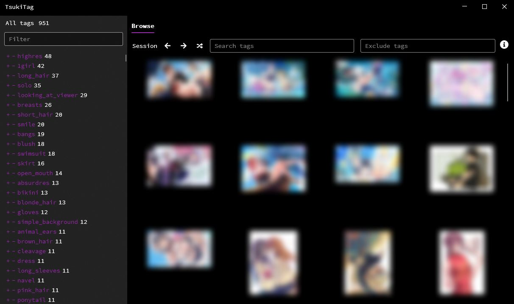
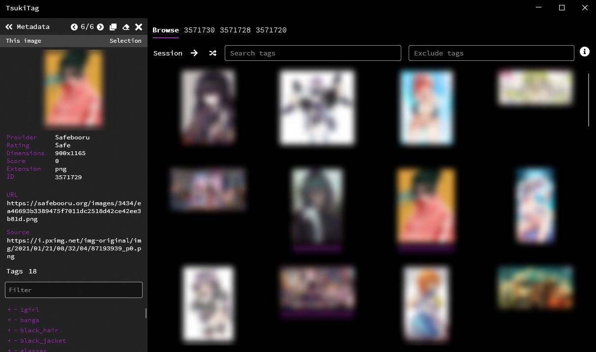
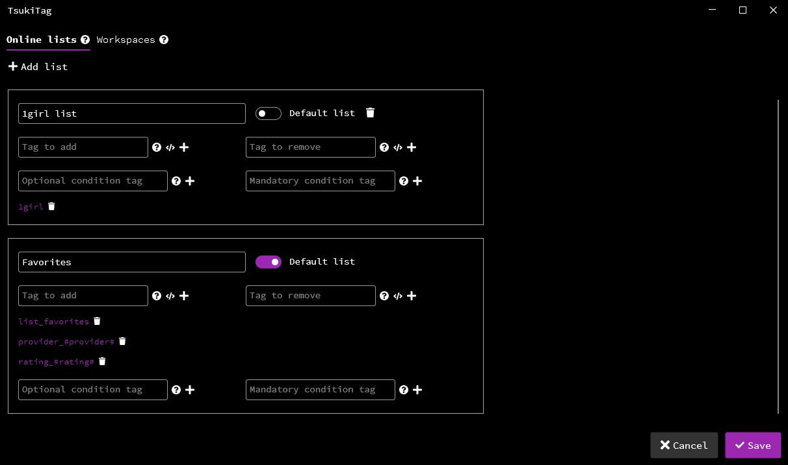
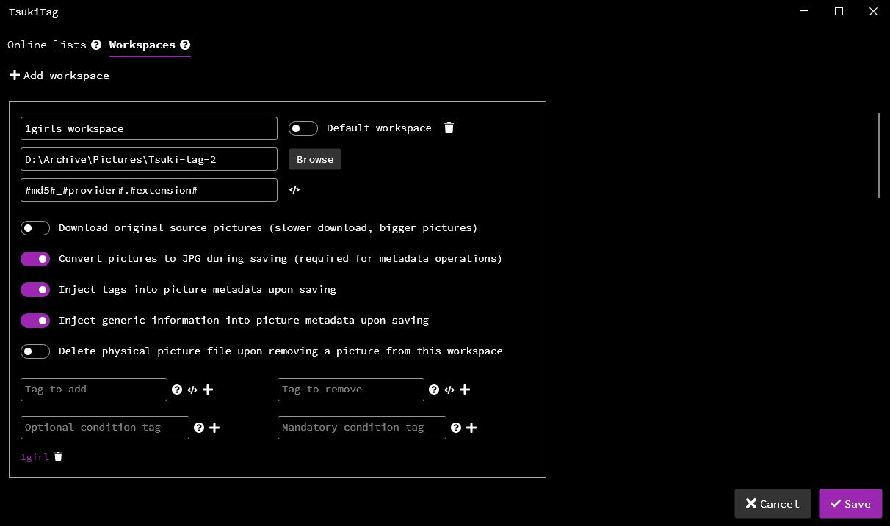

# Tsuki-tag

Tsuki-tag is an aggregated imageboard browser and collection manager, which lets you browse multiple image sources in a combined view, search images using tags, download images into configured workspaces (folders) with customization and filename templating support, and manage or curate multiple collections of your favorite images. Tsuki-tag can inject EXIF metadata information (tag, image attributes, etc.) into the images during downloading or saving, with an additional option to convert non-JPG images to JPG images which support EXIF metadata. This could provide artists with a great way of creating and organizing a collection of images for reference, or to manage and appropriately annotate their own images (with features provided in the future).





# Features

- Browse an aggregated collection of images retrieved from a number of pre-configured image providers in a paginated view.
- Fine-tune which providers are queried, along with what type of images should be shown ('safe', 'questionable', 'explicit').
- Search for images using tags and tag combinations, exclude images from being displayed using another set of tags.
- Hover over images for a quick look at their attributes and information, or select them to keep them available for batch operations.
- Open images in separate tabs and continue browsing.
- Create online lists, which are a local collection of image metadata which can be browsed just as the online providers.
- Create workspaces, which on top of the features of online lists, lets you download images to configured folders.
- Multi-selection system with support for batch operations (batch add to / remove from workspaces and online lists).
- Inject EXIF metadata into image files during workspace operations, such as the tags assigned to the image, and other generic metadata.
- Convert non-JPG images to JPG for EXIF support.
- Add, edit, or remove image tags before workspace or online list operations.
- Create tag rules for your online lists or workspaces, to automatically process an image across multiple lists.
- Automatically add or remove tags when an image is added to, or removed from a workspace or online list, with templating support.
- Specify the file names of files to be downloaded to a workspace, with templating support. 

# Online providers

Tsuki-tag uses a pre-configured list of image providers available for online browsing:

- Safebooru
- Gelbooru
- Danbooru
- Yandere
- Konachan

# Online lists

Tsuki-tag allows you to create and manage multiple collections, which are a set of images under a common name. <br>
These lists feature:

- Browse the online lists the same way as you would browse the online providers.
- The image metadata and thumbnail will be saved into a local database upon adding to an online list. When the image is being opened, it will always be downloaded from the original online provider.
- Automatically add or remove tags from an image metadata when adding it to an online list, with templating support to use image attributes as tags.
- Create optional or mandatory tag combinations to an online list. An image then can be automatically added to and processed by multiple online lists using a single operation, if it passes the configured tag requirements of a given online list.

<br>



# Workspaces

In addition to the features of online lists, Tsuki-tag also allows you to create workspaces, which are online lists with a configured folder on your local drive. When adding images to a workspace, the image is also downloaded to the specified folder. <br> 
Workspace features include:

- Browse workspaces the same way as you would browse the online providers.
- The image metadata and thumbnail will be saved into a local database upon adding to a workspace, while the image itself will be downloaded to the specified folder. When the image is being opened, it will open the locally saved version of the image if it is still available.
- Automatically add or remove tags from an image metadata when adding it to a workspace, with templating support to use image attributes as tags.
- Create optional or mandatory tag combinations to a workspace. An image then can be automatically be added to and processed by multiple workspaces using a single operation, if it passes the configured tag requirements of a given workspace.
- Customize the download, such as whether to use the original or the sample version of the image, whether to convert non-JPG images into JPG, and to whether inject tag or generic metadata information into the image file EXIF metadata. 
- Customize the file name of the downloaded image, with templating support to use image attributes as parts of the file name.

<br>



# Future features

- In addition to online image collection management, it is being planned to add support for artists and image creators as well, such as
  - Support for other EXIF metadata attributes, such as copyright, author, comment.
  - Importing files from a local folder to a workspace.
  - Open workspace pictures in the default image editor.
  - Customizable export from a workspace with minor image editing features such as resizing.
- Quality of life and UI improvements.
- Optionally integrating more online image providers.
- Other major or minor features.

# Releases

Releases of Tsuki-Tag can be found under the releases section. Windows x86-x64 versions are available for Windows 10, and x64 versions are available for Linux and MacOS. Windows and Linux versions are being actively tested.
<br><br>

## MacOS and Linux

MacOS and Linux releases are available, however,
- MacOS release is completely untested and the release version may not function at all.
- The Linux release requires an additional package for image operations, which should be available in your default repositories for most of the popular releases and can be installed by:

```
sudo apt-get install -y libgdiplus
```

# Build

On Windows 10, Visual Studio 2019 Community is advised, or alternatively Visual Studio Code with .NET Core 5.0 SDK should be adequate to build the project on both Windows and Linux operating systems.

# License

GNU GPL v3